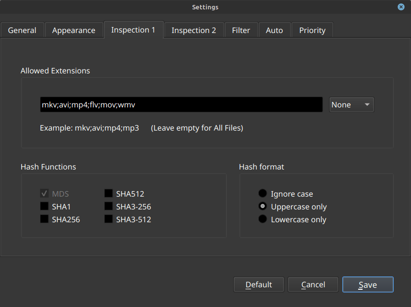

# HashInspector
To ensure file integrity, I use MD5 hashes directly within the filename. **HashInspector** automates the comparison between the filename and the actual file content.

*   **Green:** The hash in the filename matches the calculation
*   **Red:** Hash is missing

  

<figcaption><i>Figure 1: Main window</i></figcaption>
  

## Features
* **Recursive Scan:** Scans entire directories and drives, including subfolders.
* **Multithreaded Hashing:** Tests up to six different hash functions simultaneously.
* **Troubleshooting:** Open the containing folder of any file with a simple double-click.
* **Filtering:** Select files by extension and use configurable blacklists for files and directories.

## Installation
The program is provided as an AppImage, so no installation is required. I have tested HashInspector on Linux Mint, LMDE and Cachy OS. Other distributions haven't been tested yet but should work fine.

  

<figcaption><i>Figure 2: Settings</i></figcaption>
  

## Technology
HashInspector is written in **C++** using the **Qt6** framework.

## License
Licensed under the **MIT License**. Feel free to use and share it!

